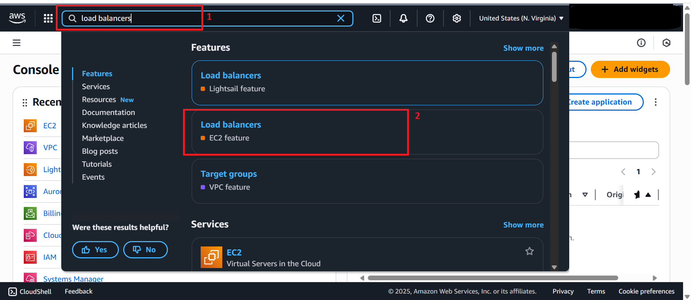
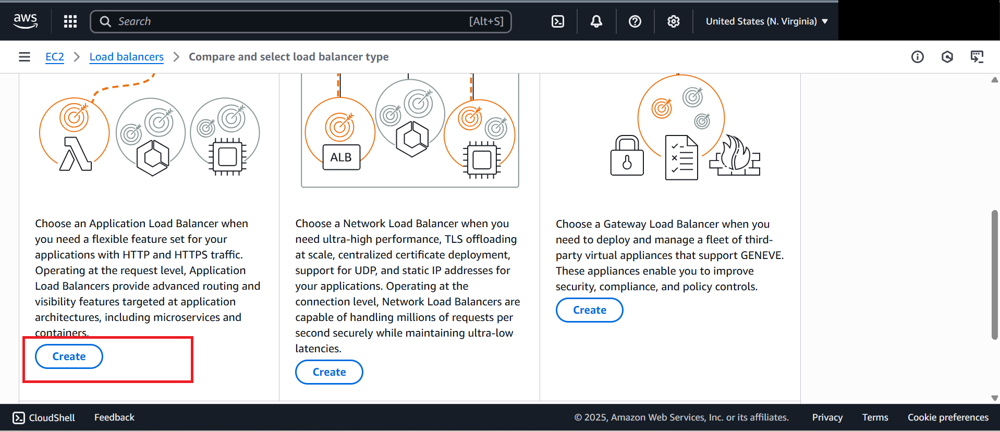
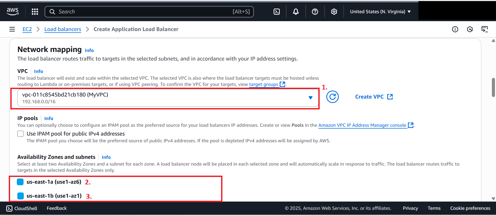
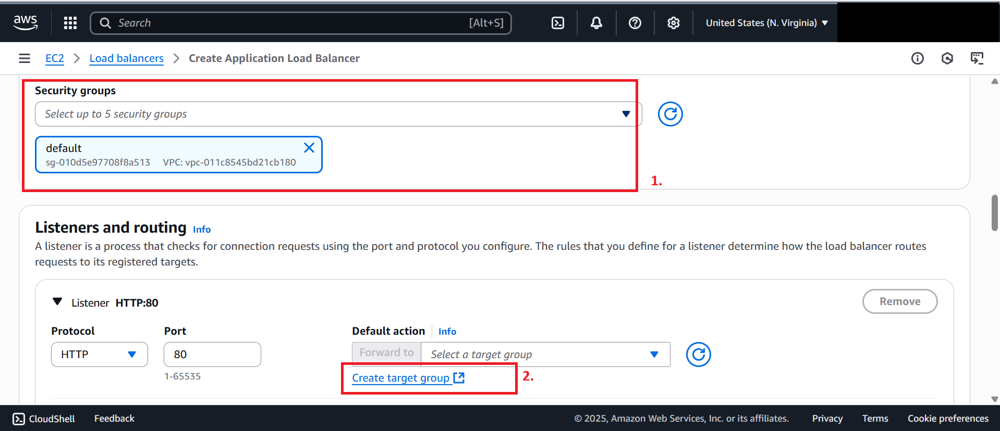
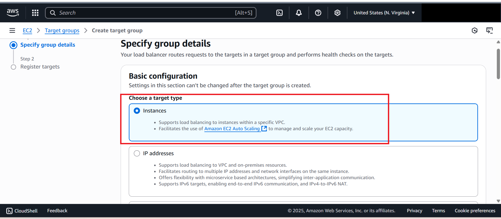
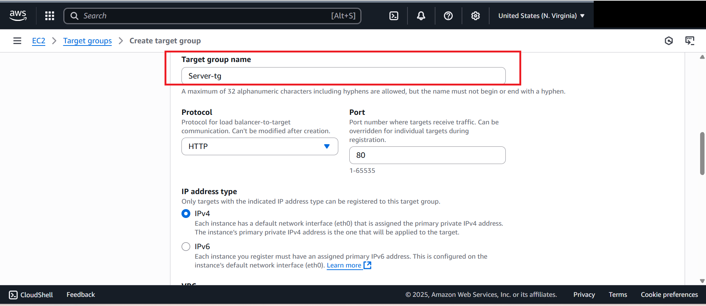
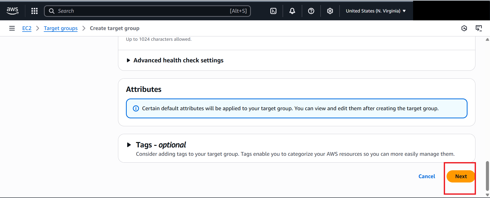
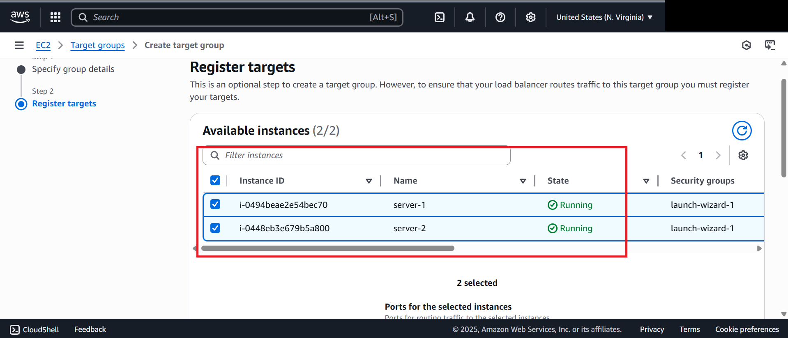
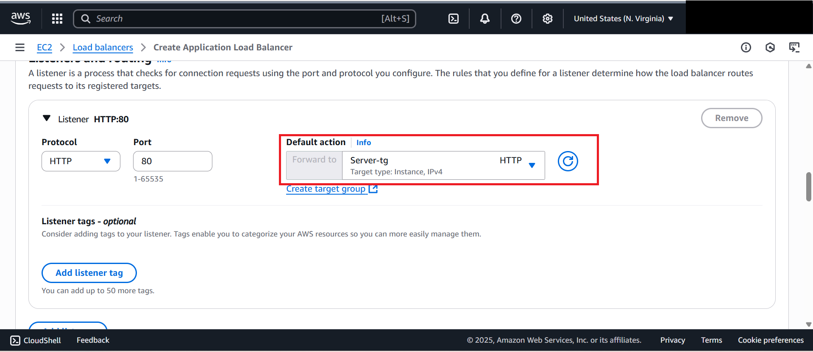
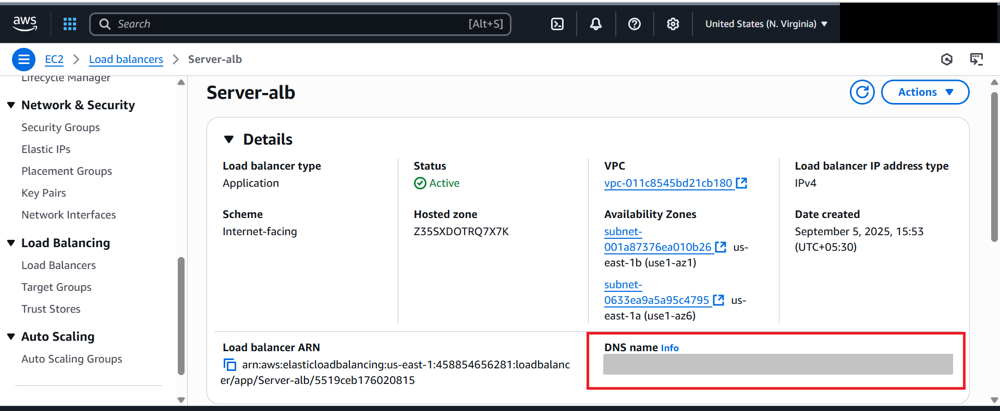

# Creating an Application Load Balancer in AWS

In this lab, we will create an **Application Load Balancer (ALB)** that distributes traffic across **two pre-provisioned EC2 instances** running a web server.

---

## Steps to Create the Load Balancer

1. **Open the Load Balancer Service**
   - In the AWS Management Console, search for **Load Balancer** in the search bar.
   - Select **Load Balancer (EC2 feature)**.  
   

2. **Create an Application Load Balancer**
   - Click **Create Load Balancer**.
   - Choose **Application Load Balancer** and click **Create**.  
   

3. **Configure the Load Balancer**
   - Enter **Load Balancer Name**: `server-alb`.
   - Select **Internet-facing** as the load balancing type.  
   

4. **Configure Networking and Security**
   - Under the **Networking (Mapping)** section, choose your **MyVPC**.
   - Select the **two Availability Zones** listed.  
   

   - Select the **default security group**.
   - Ensure the rules allow **HTTP (port 80)** and **HTTPS (port 443)** traffic from the internet, so the ALB is accessible via DNS.  
   

---

## Create a Target Group

5. **Set up Target Group**
   - In the **Listeners** section, add a target group to forward traffic to the EC2 instances.
   - Select **Create Target Group** → a new window will open.  
   

6. **Configure Target Group**
   - **Target Type**: `Instances`
   - **Target Group Name**: `server-tg`
   - **Protocol**: HTTP
   - **Port**: 80
   - Click **Next**.  
   
   

7. **Register Targets**
   - Under the available instances, select the two EC2 instances running the web servers.
   - Click **Include as pending below**.
   - Click **Create Target Group**.
   - You should see a message confirming the target group is created successfully.  
   
   
   
   
---

## Link Target Group to Load Balancer

8. **Attach Target Group**
   - Go back to the **Load Balancer creation window**.
   - Refresh the **Target Group** tab and select the newly created target group.
   - Click **Create Load Balancer**.  
   
   

---

## Test the Load Balancer

9. **Access the Load Balancer**
   - Once the ALB is created, copy its **DNS name**.
   - Paste the DNS name into a browser.
   - Refresh the page multiple times.
   - You will notice the response alternates between **Web Server 1** and **Web Server 2**, confirming that traffic is being load balanced.  
    

---

**✅ Congratulations!** You have successfully created and tested an Application Load Balancer distributing traffic across two EC2 instances.
